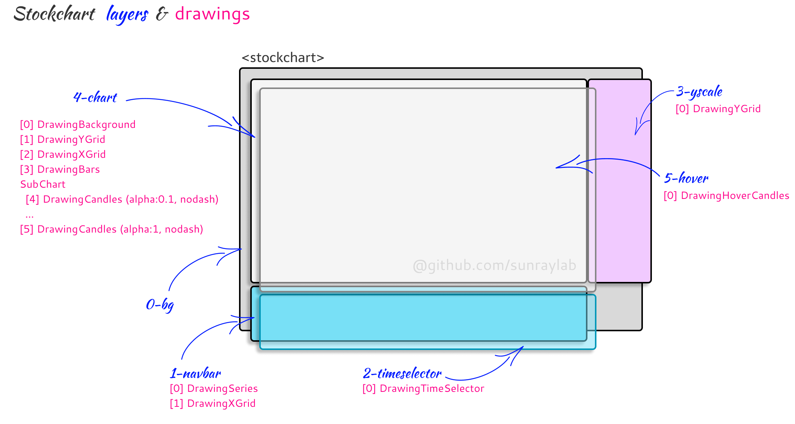

# stockchart

HTML5 stock chart package in go.

Generate interactive, responsive, and performant chart with HTML5 canvas and web assembly.

The chart can be embedded into any HTML pages. 


See the [example](https://github.com/sunraylab/stockchart/tree/master/examples).

# Features
- draw candlestick with OHLCV series
- X time axis navigator
- X time axis with auto scale and autolabelling
- zoom-in and zoom-out with the mouse wheel
- shift selection with the Shift-Key and the mouse wheel
- Y value axis with auto scale and auto labelling
- responsive: handle resize event and browser zoom
- embedding chart with a single HTML elemnt

# Characteristics

- drawing on any browser accepting [HTML5 canvas](https://developer.mozilla.org/en-US/docs/Web/HTML/Element/canvas) & Webassembly
- only GO, no JS
- Written in go 1.19

## How to use it

You need to add a `<stockchart>` element in your HTML page, specifying a unique chart ID like:

```html
<stockchart id="mychart" style="height:450px; width:100%; display: block;"></stockchart>
```

Than in tha main function of your wasm code, your need to feed a data set

```go
	// build your dataset 
	dataset := BuildRandomDataset()
```

and to pass it to the StockChart factory

```go
	// Create a new chart
	_, err := stockchart.NewStockChart("mychart", rgb.White, myDataset)
	if err != nil {
		fmt.Println(err.Error())
		os.Exit(1)
	}
```

That's it!

## How it works

We've used HTLM5 ``<canvas>`` providing the APIs to draw in a 2D context. 

The stockchart struct provides the chart factory: 
- default chart builder, adding canvas to the DOM
- handles the resize event and coordinate calculations
- dispatch events, such as mouse events or time selection changes, to the layers and their drawings

To avoid to redraw everythings everytime a user hover the graph or change the time selection we've used the layering technics.
Every layer is a canvas. Canvas are transparent by default also you can stack them and redraw on one canvas keeping the drawing on the other one intact.

The drawingLayer struct handle the layout of the layer and embed a stack of drawings.

Overall drawing is breakdown in multiple functionnal drawings, each one added to one or many layers. 
Functionnal drawings are based on the drawing stuct providing some drawing primitives and embedding the series of data to draw.



[see more technical here](doc.md)

### Use Web Assembly with go

Some documentation available here https://tinygo.org/docs/guides/webassembly/ and here https://github.com/golang/go/wiki/WebAssembly

Go provides a specific js file called `wasm_exec.js` that need to be served by your webpapp. This file is located in the ``/misc/wasm/`` subdirectory of your go root path. Usually we copy it to the folder containing all static files of your webapp, like `cp "$(go env GOROOT)/misc/wasm/wasm_exec.js" /example/webapp` for the above example. It's important to get the version corresponding to your go environment, it's why we recomend to copy it from your GOROOT.

## Change log

- v0.7.0 alpha: major change in management of selection, now works with request out of the chart
	- new feat, candle selection is displayed and stock on the navbar and on the chart 
- v0.6.1 alpha: upgrade with timeline v2.2.1
- v0.6.0 alpha: handle click event to select a data, fire func on select
- v0.5.0 alpha: fix + enhance series list
- v0.4.0 alpha: improved management of time selection + renaming the package
- v0.3.0 alpha: major refactoring
- v0.2.1 alpha: improved management of datalist
- v0.2.0 alpha: X time axis cursor position in the graph area
- v0.1.0 alpha: 1st try

V0.7.0 introduces a debug function to easily generate output, see [debug.go](stockchart/debug.go) file

## References

- The Web Assembly code generated is based on the [webapi package](https://github.com/gowebapi/webapi).
- [Browsers running web assembly](https://developer.mozilla.org/en-US/docs/WebAssembly#browser_compatibility)
